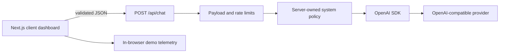

# OpsPilot v2

[](https://github.com/sarusarvesh993-cyber/opspilot-v2/actions/workflows/ci.yml)
[](https://nextjs.org/)
[](https://www.typescriptlang.org/)

A portfolio demonstration of an AI-assisted DevSecOps workspace. OpsPilot combines a server-side OpenAI-compatible chat endpoint with a responsive operations dashboard and clearly labelled browser-generated simulations.

**Live demo:** [opspilot-v2.vercel.app](https://opspilot-v2.vercel.app/)

> [!IMPORTANT]
> OpsPilot does **not** connect to Kubernetes clusters, cloud accounts, monitoring systems, or deployment pipelines. Metrics, audits, and diagnostics outside the AI chat are simulated UI scenarios. It never executes remediation commands.

## What is implemented

- Server-side AI chat using the OpenAI SDK and OpenAI-compatible providers such as OpenRouter
- A fixed system policy that prevents the demo from claiming real infrastructure access
- Runtime request validation, payload limits, role filtering, provider timeouts, and safe error responses
- Best-effort per-instance rate limiting for the public demo endpoint
- Responsive and keyboard-accessible chat, metrics, security, and diagnostics workspaces
- Strict TypeScript, ESLint, built-in Node.js tests, dependency auditing, and production builds in CI
- Multi-stage, non-root Docker image using Next.js standalone output

## What is simulated

| Workspace | Behavior |
| --- | --- |
| Metrics | CPU, memory, and network values drift in the browser |
| Security | Adds example audit findings without scanning a network |
| Diagnostics | Displays results for bundled scenarios without uploading files |
| Telemetry card | Captures the current simulated values when a status prompt is sent |

This distinction is intentional: the repository demonstrates UI, API design, validation, and deployment practices without pretending to be a production control plane.

## Architecture



The API key remains on the server. Client requests may contain only `user` and `assistant` messages; a caller cannot inject a `system` role through the API. See [ARCHITECTURE.md](ARCHITECTURE.md) for trust boundaries and production limitations.

## Tech stack

- Next.js 16 App Router and React 19
- TypeScript in strict mode
- Tailwind CSS 4
- OpenAI Node SDK
- Node.js built-in test runner
- GitHub Actions, Docker, and Docker Compose

## Run locally (PowerShell)

### Prerequisites

- Node.js 22.18 or newer
- npm 10 or newer
- An OpenAI or OpenRouter API key to use chat

```powershell
# Clone and enter the repository
git clone https://github.com/sarusarvesh993-cyber/opspilot-v2.git
Set-Location opspilot-v2

# Create local configuration, then edit OPENAI_API_KEY in VS Code
Copy-Item .env.example .env.local
code .env.local

# Reproducible install and local server
npm ci
npm run dev
```

Open <http://localhost:3000>. The simulated workspaces run without an API key; only AI chat requires one.

## Configuration

| Variable | Required | Default | Purpose |
| --- | --- | --- | --- |
| `OPENAI_API_KEY` | For chat | none | Server-side provider credential |
| `OPENAI_BASE_URL` | No | OpenAI endpoint | OpenAI-compatible endpoint |
| `OPENAI_MODEL` | No | `gpt-4o-mini` | Provider model ID |
| `OPENAI_MAX_OUTPUT_TOKENS` | No | `900` | Output cap, bounded from 100 to 2,000 |

For OpenRouter, either use an `sk-or-...` key (automatic endpoint detection) or set `OPENAI_BASE_URL=https://openrouter.ai/api/v1`. A real `.env` or `.env.local` file is ignored by Git.

## Quality checks

```powershell
npm run check   # ESLint + TypeScript + tests
npm run build   # Optimized standalone production build
npm audit --omit=dev --audit-level=high
```

The CI workflow runs all three checks on every pull request to `main`, then builds the Docker image. Unlike a build-only workflow, lint and type failures cannot be hidden by Next.js configuration.

## Docker

Docker Compose reads variables from a root `.env` file. Create it from the safe template before starting the container:

```powershell
Copy-Item .env.example .env
code .env
docker compose up --build
```

Or build and run directly:

```powershell
docker build -t opspilot-v2 .
docker run --rm -p 3000:3000 --env-file .env opspilot-v2
```

The runtime image uses an unprivileged user and exposes a health check on port 3000.

## API contract

`POST /api/chat`

```json
{
  "messages": [
    { "role": "user", "content": "Explain a safe Kubernetes rollout strategy." }
  ]
}
```

Successful response:

```json
{
  "response": "..."
}
```

The route rejects unsupported roles, empty content, oversized conversations, invalid JSON, and excessive requests. Upstream provider details are logged server-side but are not exposed to clients.

## Project structure

```text
app/
  api/chat/route.ts          # HTTP boundary and safe error mapping
  layout.tsx                 # Metadata and global document shell
  page.tsx                   # Main dashboard route
components/ops-pilot/        # Focused dashboard and workspace components
lib/
  ai.ts                      # Provider configuration and system policy
  chat-validation.ts         # Runtime request validation
  rate-limit.ts              # Best-effort demo rate limiter
tests/                       # Validation, configuration, and limiter tests
```

## Production gaps and roadmap

Before using this design for a real operations platform:

1. Add authentication, authorization, and tenant isolation.
2. Replace the in-memory limiter with a distributed store such as Redis.
3. Add an approval workflow and immutable audit trail before any tool execution.
4. Integrate read-only cloud/cluster adapters with narrowly scoped credentials.
5. Add persistent conversations with retention and deletion controls.
6. Add end-to-end browser tests and observability for the API route.

These gaps are documented rather than hidden because production DevSecOps systems require explicit trust boundaries.
